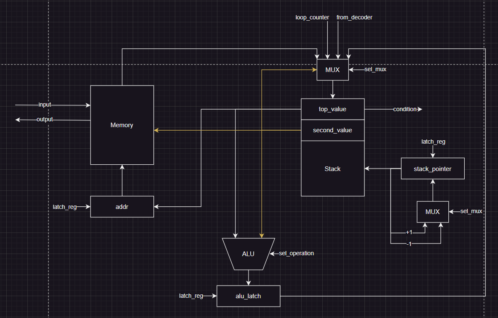

# Архитектура компьютера. Лабораторная работа 3.

- Раевский Григорий Романович, P3221
- `forth | stack | neum | mc -> hw | instr | struct | stream | mem | pstr | prob1 | cache`
- Упрощенный вариант

## Язык программирования

```text
program ::= <procedure-definition>* <command>*

procedure-definition ::= ":" <identifier> <command>* ";"

command ::= <identifier> | <literal> | <loop> | <if-then> | <print-string>

loop ::= <literal> <literal> "do" <command>* "loop"

if-then ::= "if" <command>* "then"

print-string ::= '."' <string-literal> '"'

identifier ::= [a-zA-Z_][a-zA-Z0-9_]*

literal ::= [0-9]+ | "i"

operation ::= "+" 
            | "dup" 
            | "dec_i" 
            | "save" 
            | "mod" 
            | "or" 
            | "==" 
            | "cr" 
            | "inp" 
            | "out" 
            | "store" 
            | "load" 
            | "."

string-literal ::= <any except '"'>

comment ::= "\" <text>
```

_Операции потока программы_

- `if`\ `then` - условный переход (если на вершине стека не 0, тело IF выполняется)
- `do`\ `loop` - цикл от и до
- `dec_i` - уменьшить значение итерируемой переменной i на 1

_Операции для работы со стеком_

- `<число>` - положить число на вершину стека
- `i` - положить значение текущей итерации цикла на верх
- `.` - вывести верхний элемент стека
- `dup` - продублировать верхний элемент стека
- `load` - загрузить элемент из ячейки памяти, указанной в стеке, в стек
- `store` - сохранить элемент из стека по адресу, указанному в стеке

_Арифметические операции_

- `mod` - остаток от деления первого числа со стека на второе
- `==` - сравнить два верхних элемента стека, если они равны, поместить 1, иначе 0
- `or` - логическое ИЛИ для двух верхних элементов стека
- `+` - сложить два верхних элемента стека

_Операции работы с IO_

- `cr` - перенос строки
- `."<строка"` - вывести строку в пользовательский вывод
- `inp` - считать элемент пользовательского ввода и сохранить его в стек
- `out` - вывести элемент из стека в пользовательский вывод

_Особенности_

- Код выполняется последовательно
- При трансляции процедуры сохраняются, после чего подставляются на места вызова
- Проверка для условного перехода if вызывает удаление элемента из стека

## Организация памяти

Модель памяти процессора:

- Фон Неймановская архитектура - память данных и команд объединены:
- Длина машинного слова - 32 бита
- Линейное адресное пространство
- Реализуется списком инструкций\чисел
- Одна инструкция - одна ячейка памяти
- Абсолютная адресация памяти

Модель памяти:

- При запуске модели память выделяется статически, в нее загружаются инструкции и данные (для строк из кода, если есть)
- Все инструкции, кроме управляющих потоком исполнения, взаимодействуют со стеком
- Доступ программиста имеется регистру `loop_counter`
- Можно осуществлять запись и чтение из памяти
- Инструкции хранятся в начале общей памяти, статические данные хранятся в определенных адресах
- Адреса `0x0100` и `0x0101` - адреса ввода и вывода соответственно
- Процедуры подставляются транслятором, то есть не хранятся напрямую в памяти
- Пользовательский ввод можно сохранять в память начиная с ячейки `0x0200`
- Строковые литералы хранятся в памяти начиная с ячейки `0x0300`

```text
            Stack
+--------------------------+
| 00  : val                |
|    ...                   |
| 10  : val                | 
| 11  : val                | <- stack pointer
|    ...                   |
+--------------------------+

            Memory
+------------------------------+
| 00  : instruction            |
| 01  : instruction            |
| ...                          |
| 05  : instruction            |
| ...                          |
| n  : HALT                    |
| ...                          |
| 0x0100  : INPUT_ADDR         |
| 0x0101  : OUTPUT_ADDR        |
| ...                          |
| 0x0200  : INPUT_STORAGE      |
| ...                          |
| 0x0300  : STRING_STORAGE     |
| ...                          |
+------------------------------+

```

- Литералы загружаются на стек с помощью `LOAD`
- Автоматически загружаются в память при запуске модели из раздела `"data"` машинного кода
- Один символ строки - одна ячейка памяти. В ячейке перед строкой хранится ее длинна
- Команды разворачиваются транслятором в набор инструкций, который и загружается в память
- Переход к следующей инструкции выполняется с помощью:
    1. Последовательного перехода
    2. После проверки условия окончания цикла
    3. Условный переход `JZ`
- Процедуры сохраняются транслятором, после чего подставляются на места вызова, как набор команд

## Система команд

Особенности модели процессора

- Машинное слово 32-х битное, знаковое
- Абсолютная адресация
- Программисту доступен регистр `loop_counter`
- Специальные регистры, недоступные программисту:
    1. `stack_pointer` - указатель стека
    2. `alu_latch` - регистр, который хранит результат работы ALU
    3. `pc` - счетчик программ, указывает на исполняемую инструкцию
    4. `instr_latch`  - регистр, который хранит текущую инструкцию после загрузки ее из памяти
    5. `mem_inp_pointer` - указатель, хранящий адрес для сохранения символа в память из стека
    6. `mem_out_pointer` - указатель, хранящий адрес для загрузки символа из памяти в стек
    7. `init_val` - регистр, хранящий начальное значение цикла, обновляется значением из стека при начале выполнения
       цикла
    8. `max_val` - регистр, хранящий максимальное значение цикла, обновляется значением из стека при начале выполнения
       цикла
    9. `step` - регистр, который хранит шаг цикла
    10. `jump_latch` - регистр, сохраняющий факт выполнения перехода
    11. `halted` - регистр, хранящий состояние модели
- Ввод\Вывод - memory-mapped, ячейки памяти `0x0100` и `0x0101` хранят значение ввода и вывода (захардкожены в
  классе `IOAddresses`)
- Обработка данных включает:
    1. Операции над значениями в стеке
    2. Операции над памятью
    3. Операции ввода\вывода
- Поток управления:
    1. Инкремент `pc` после исполнения инструкции
    2. Условный переход `JZ`
    3. Переход на основе конца итерации цикла
    4. `HALT` - остановка модели

### Набор инструкций

Инструкции управления потоком исполнения

| Инструкция        | Кол-во тактов | Описание                                                                                                                                  |
|-------------------|:-------------:|-------------------------------------------------------------------------------------------------------------------------------------------|
| `HALT`            |       1       | Остановка программы                                                                                                                       |
| `JZ` [addr]       |       2       | Условный переход по адресу, если на вершине стека 0                                                                                       |
| `LOOP_START`      |       3       | Сохранение начального, конечного параметров цикла, а так же первого значения итерируемой переменной в регистры                            |
| `LOOP_END` [addr] |      2/3      | Проверка условия окончания цикла. Если цикл закончен, то переход к следующей инструкции (3 такта), иначе переход в начало цикла (2 такта) |
| `DEC_I`           |       1       | Уменьшение значения итерируемой переменной на 1                                                                                           |

Инструкции для работы со стеком

| Инструкция   | Кол-во тактов | Описание                                                                                                                                                                                                                           |
|--------------|:-------------:|------------------------------------------------------------------------------------------------------------------------------------------------------------------------------------------------------------------------------------|
| `PUSH` [val] |      1/2      | Добавить на вершину стека значение `value`. Если `value` число, или `i`, то добавляется число\значение итерируемой переменной - 1 такт. Если `value` - `in_pointer` или `out_pointer`, то добавляются указатели на память, 2 такта |
| `DUP`        |       2       | Продублировать верхний элемент стека                                                                                                                                                                                               |
| `PRINT_TOP`  |       3       | Вывести верхний элемент стека                                                                                                                                                                                                      |

Инструкции для работы с памятью

| Инструкция | Кол-во тактов | Описание                                               |
|------------|:-------------:|--------------------------------------------------------|
| `LOAD`     |       2       | Загрузить значение из памяти в стек по адресу из стека |
| `SAVE`     |       2       | Сохранить значение из стека по адресу из стека         |
| `CR`       |       4       | Перевод строки в выводе                                |

Инструкции для работы с арифметикой

| Инструкция | Кол-во тактов | Описание                                                                                |
|------------|:-------------:|-----------------------------------------------------------------------------------------|
| `EQUALS`   |       2       | Сравнить 2 числа из вершины стека, поместить 1 на стек, если равны, иначе 0             |
| `MOD`      |       2       | Получить остаток от деления одного числа из стека на другое, результат сохранить в стек |
| `OR`       |       2       | Логическое ИЛИ для двух элементов из вершины стека, результат сохраняется в стек        |
| `ADD`      |       2       | Сложить 2 числа из вершины стека и положить результат на стек                           |

### Кодирование инструкций

- Машинный код сериализуется в JSON
- Состоит из блоков `data` (хранение статических данных - строк) и `program` - набора инструкций
- Один элемент списка `data` - одна строка
- Один элемент списка `program` - одна инструкция
- Индекс списка используется для переходов, хранит адрес инструкции

Пример:

```json
{
  "data": {
    "0": [
      12,
      72,
      101,
      108,
      108,
      111,
      32,
      119,
      111,
      114,
      108,
      100,
      33
    ]
  },
  "program": [
    {
      "index": 2,
      "opcode": "PUSH",
      "arg": 1
    }
  ]
}
```

Здесь

- `data` - блок хранения статических данных, строк
- `program` - список, хранящий инструкции
- `index` - адрес инструкции
- `opcode` - код инструкции
- `arg` аргумент инструкции, может быть `null`

В модуле [isa.py](source/isa.py):

- `Opcode` - перечисление кодов операций

## Транслятор

Интерфейс командной строки:

```
usage: translator.py [-h] [-a] [-i INPUT_FOLDER] [-o OUTPUT_FOLDER] [source_file] [target_file]

Translate FORTH code to machine code.

positional arguments:
  source_file           The FORTH source file to translate.
  target_file           Machine code target file.

options:
  -h, --help            show this help message and exit
  -a, --all             Process all FORTH files in the specified directory.
  -i INPUT_FOLDER, --input_folder INPUT_FOLDER
                        Directory containing FORTH files.
  -o OUTPUT_FOLDER, --output_folder OUTPUT_FOLDER
                        Directory to store the output JSON files.
```

Реализовано в модуле [translator.py](source/translator.py)

Принцип работы транслятора:

- Текст разбивается на строки
- Начинается первый проход
- Создаются 2 списка: procedures (хранение процедур по имени) и main_program (основная программа)
- Процедуры (начало - `: <имя>`, конец - `;`) выделяются из кода и сохраняются
- После чего начинается подстановка кода процедур на места их вызовов
- Преобразование циклов и выделение строковых литералов (они сохраняются в словарь strings,
  как `"отступ адреса, хранящего длину строки" : длина строки, коды символов`)
- Во время второго прохода команды, которые равны инструкциям преобразуются напрямую
- Команды, которые состоят из нескольких инструкций, раскрываются транслятором:
    1. Для команды цикла сохраняется индекс для перехода к началу текущего цикла
    2. Для команды условного перехода сохраняется индекс для выполнения `JZ`
- После второго прохода блоки `data` и `program` объединяются

## Модель процессора

Интерфейс командной строки:

```
usage: machine.py [-h] [-a] [input_file] [machine_code_file]

Run FORTH machine code simulations.

positional arguments:
  input_file         Path to the input file for the machine.
  machine_code_file  Path to a specific machine code file to run.

options:
  -h, --help         show this help message and exit
  -a, --all          Process all JSON files in the machine code directory.
```

Реализован в модуле [machine.py](source/machine.py)

### DataPath



Реализован в классе `DataPath` в модуле [machine.py](source/machine.py)

- `Memory` - общая память для инструкций и статических данных
- `Stack` - стек
- `ALU` - модуль для выполнения арифметических операций
- `stack_pointer` - указатель стека

Сигналы DataPath:

- `latch_red` - защелкнуть соответсвующий регистр
- `sel_operation/sel_mux` - выбрать значение на мультиплексоре/АЛУ
- `condition` - условие для `JZ` перехода
- `loop_counter` - текущее значение счетчика цикла
- `from_decoder` какое-то значение из ControlUnit
- `input/output` - запись/чтение из памяти

Особенности стека:

- Список целых чисел
- `sp` - stack pointer, указатель стека
- Стандартные операции `push/pop`

### ControlUnit


Реализован в классе `ControlUnit` в модуле [machine.py](source/machine.py)

- Запись инструкции в регистр в методе `fetch_instruction`
- Обработка инструкции декодером реализована в методе `execute_instruction`
- Цикл обработки инструкций в методе `run`:
    1. Получение инструкции из памяти и запись в регистр
    2. Выполнение инструкции (обработка, сигналы, защелкивание)
    3. Проверка остановки модели
- `Memory` - общая память инструкций\данных
- `program_counter` - счетчик (указатель) инструкций
- `loop_init_reg`, `loop_max_reg`, `loop_step_reg` - регистры хранения параметров цикла
- `loop_counter` - регистр текущей итерации цикла
- `Decoder` - декодер инструкций
- `mem_inp/out_pointer` - указатели адресов для сохранения/чтения из памяти
- `input/output` - ввод/вывод
- `instr_latch` - регистр хранения текущей инструкции

Сигналы ControlUnit:

- `latch_reg` - защелкнуть соответсвующий регистр
- `sel_mux` - выбрать значение на мультиплексоре
- `instr` - передать инструкцию в декодер
- `condition` - сигнал из DataPath для проверки остановки цикла/выполнения перехода

Особенности модели процессора:

- Остановка при выполнении инструкции `HALT` или окончании `input_buffer`
- Состояние наблюдается после каждой инструкции
- В журнал модели сохраняется:
    1. Текущее значение тика
    2. Текущий program counter
    3. Текущий loop counter
    4. Вершина стека
    5. Указатель стека
    6. Инструкция
    7. Опционально аргумент инструкции
- Максимальное количество инструкций - 256
- Максимальное количество данных, сохраненных в память (обычно ввод) - 256
- Максимальное количество символов для строк, прописанных в коде - 256

## Тестирование

Тестирование выполняется при помощи golden test-ов

- Тесты реализованы при помощи [test_golden.py](tests/test_golden.py)
- Реализованные программы лежат в [progs](progs)
- Примеры ввода находятся в [inp](source/inp)
- Конфигурации в [golden](tests/golden) в формате `*.yml`, содержат:
    1. Код программы
    2. Входные данные
    3. Машинный код
    4. Выходные данные
    5. Журнал работы процессора

Запустить тесты: `poetry run pytest . -v`

Обновить конфигурацию golden tests: `poetry run pytest . -v --update-goldens`

CI при помощи Github Action [python-app.yml](.github/workflows/python-app.yml):

```
name: Python CI

on:
  push:
    branches:
      - main
    paths:
      - ".github/workflows/*"
      - "**"

jobs:
  test:
    runs-on: ubuntu-latest

    steps:
      - name: Checkout code
        uses: actions/checkout@v4

      - name: Set up Python
        uses: actions/setup-python@v4
        with:
          python-version: 3.11

      - name: Install dependencies
        run: |
          python -m pip install --upgrade pip
          pip install poetry
          poetry install

      - name: Run tests and collect coverage
        run: |
          poetry run coverage run -m pytest .
          poetry run coverage report -m
        env:
          CI: true

  lint:
    runs-on: ubuntu-latest

    steps:
      - name: Checkout code
        uses: actions/checkout@v4

      - name: Set up Python
        uses: actions/setup-python@v4
        with:
          python-version: 3.11

      - name: Install dependencies
        run: |
          python -m pip install --upgrade pip
          pip install poetry
          poetry install

      - name: Check code formatting with Ruff
        run: poetry run ruff format --check .

      - name: Run Ruff linters
        run: poetry run ruff check .
```

где:

- `poetry` - управления зависимостями для языка программирования Python
- `coverage` - формирование отчёта об уровне покрытия исходного кода
- `pytest` - утилита для запуска тестов
- `ruff` - утилита для форматирования и проверки стиля кодирования

Когда выполняется пуш в ветку `main`, запускаются следующие задачи:

- `test` - запуск тестов и формирование отчета
- `lint` - запуск линтера `ruff`

Реализованные алгоритмы:

- [cat](tests/golden/cat.yml) - печать данных, подаваемых на вход, строки потенциально бесконечны
- [hello](tests/golden/hello.yml) - напечатать `Hello World!`
- [hello_user_name](tests/golden/hello_user_name.yml) - запросить у пользователя его имя и поздороваться с ним
- [prob1](tests/golden/prob1.yml) - реализация решения первой проблемы проекта Эйлера

Пример работы для [hello](tests/golden/hello.yml):

- Исходный код программы

```text
."Hello world!" # Строка, заключенная в (.") (") будет выведена моделью процессора
```

- Вывод транслятора

```text
source LoC: 1 code instr: 12
```

- Машинный код

```text
{
    "data": {                   
        "0": [                 
            12,               
            72,                 
            101,                
            108,                
            108,                
            111,                
            32,                 
            119,                
            111,               
            114,                
            108,                
            100,                
            33                  
        ]                       
    },                          
    "program": [                
        {
            "index": 0,        
            "opcode": "PUSH",   
            "arg": 768
        },
        {
            "index": 1,
            "opcode": "LOAD",  
            "arg": null
        },
        {
            "index": 2,
            "opcode": "PUSH", 
            "arg": 1
        },
        {
            "index": 3,
            "opcode": "LOOP_START",
            "arg": null
        },
        {
            "index": 4,
            "opcode": "PUSH",
            "arg": 768
        },
        {
            "index": 5,
            "opcode": "PUSH",
            "arg": "i"
        },
        {
            "index": 6,
            "opcode": "ADD",
            "arg": null
        },
        {
            "index": 7,
            "opcode": "LOAD",
            "arg": null
        },
        {
            "index": 8,
            "opcode": "PUSH",
            "arg": 257
        },
        {
            "index": 9,
            "opcode": "SAVE",
            "arg": null
        },
        {
            "index": 10,
            "opcode": "LOOP_END",
            "arg": 3
        },
        {
            "index": 11,
            "opcode": "HALT",
            "arg": null
        }
    ]
}
}
```

- Вывод модели процессора

```text
  DEBUG    root:machine.py:168 TICK:   1 PC:   1 LOOP_COUNTER:   0 TOP OF STACK:     768 SP:   1 	LOAD arg: None
  DEBUG    root:machine.py:168 TICK:   3 PC:   2 LOOP_COUNTER:   0 TOP OF STACK:      12 SP:   1 	PUSH arg: 1
  DEBUG    root:machine.py:168 TICK:   4 PC:   3 LOOP_COUNTER:   0 TOP OF STACK:       1 SP:   2 	LOOP_START arg: None
  DEBUG    root:machine.py:168 TICK:   7 PC:   4 LOOP_COUNTER:   1 TOP OF STACK: Empty   SP:   0 	PUSH arg: 768
  DEBUG    root:machine.py:168 TICK:   8 PC:   5 LOOP_COUNTER:   1 TOP OF STACK:     768 SP:   1 	PUSH arg: i
  DEBUG    root:machine.py:168 TICK:   9 PC:   6 LOOP_COUNTER:   1 TOP OF STACK:       1 SP:   2 	ADD arg: None
  DEBUG    root:machine.py:168 TICK:  11 PC:   7 LOOP_COUNTER:   1 TOP OF STACK:     769 SP:   1 	LOAD arg: None
  DEBUG    root:machine.py:168 TICK:  13 PC:   8 LOOP_COUNTER:   1 TOP OF STACK:      72 SP:   1 	PUSH arg: 257
  DEBUG    root:machine.py:168 TICK:  14 PC:   9 LOOP_COUNTER:   1 TOP OF STACK:     257 SP:   2 	SAVE arg: None
  DEBUG    root:machine.py:38 output: '' << 'H'
  DEBUG    root:machine.py:168 TICK:  16 PC:  10 LOOP_COUNTER:   1 TOP OF STACK: Empty   SP:   0 	LOOP_END arg: 3
  DEBUG    root:machine.py:168 TICK:  18 PC:   4 LOOP_COUNTER:   2 TOP OF STACK: Empty   SP:   0 	PUSH arg: 768
  DEBUG    root:machine.py:168 TICK:  19 PC:   5 LOOP_COUNTER:   2 TOP OF STACK:     768 SP:   1 	PUSH arg: i
  DEBUG    root:machine.py:168 TICK:  20 PC:   6 LOOP_COUNTER:   2 TOP OF STACK:       2 SP:   2 	ADD arg: None
  DEBUG    root:machine.py:168 TICK:  22 PC:   7 LOOP_COUNTER:   2 TOP OF STACK:     770 SP:   1 	LOAD arg: None
  DEBUG    root:machine.py:168 TICK:  24 PC:   8 LOOP_COUNTER:   2 TOP OF STACK:     101 SP:   1 	PUSH arg: 257
  DEBUG    root:machine.py:168 TICK:  25 PC:   9 LOOP_COUNTER:   2 TOP OF STACK:     257 SP:   2 	SAVE arg: None
  DEBUG    root:machine.py:38 output: 'H' << 'e'
  DEBUG    root:machine.py:168 TICK:  27 PC:  10 LOOP_COUNTER:   2 TOP OF STACK: Empty   SP:   0 	LOOP_END arg: 3
  DEBUG    root:machine.py:168 TICK:  29 PC:   4 LOOP_COUNTER:   3 TOP OF STACK: Empty   SP:   0 	PUSH arg: 768
  DEBUG    root:machine.py:168 TICK:  30 PC:   5 LOOP_COUNTER:   3 TOP OF STACK:     768 SP:   1 	PUSH arg: i
  DEBUG    root:machine.py:168 TICK:  31 PC:   6 LOOP_COUNTER:   3 TOP OF STACK:       3 SP:   2 	ADD arg: None
  DEBUG    root:machine.py:168 TICK:  33 PC:   7 LOOP_COUNTER:   3 TOP OF STACK:     771 SP:   1 	LOAD arg: None
  DEBUG    root:machine.py:168 TICK:  35 PC:   8 LOOP_COUNTER:   3 TOP OF STACK:     108 SP:   1 	PUSH arg: 257
  DEBUG    root:machine.py:168 TICK:  36 PC:   9 LOOP_COUNTER:   3 TOP OF STACK:     257 SP:   2 	SAVE arg: None
  DEBUG    root:machine.py:38 output: 'He' << 'l'
  DEBUG    root:machine.py:168 TICK:  38 PC:  10 LOOP_COUNTER:   3 TOP OF STACK: Empty   SP:   0 	LOOP_END arg: 3
  DEBUG    root:machine.py:168 TICK:  40 PC:   4 LOOP_COUNTER:   4 TOP OF STACK: Empty   SP:   0 	PUSH arg: 768
  DEBUG    root:machine.py:168 TICK:  41 PC:   5 LOOP_COUNTER:   4 TOP OF STACK:     768 SP:   1 	PUSH arg: i
  DEBUG    root:machine.py:168 TICK:  42 PC:   6 LOOP_COUNTER:   4 TOP OF STACK:       4 SP:   2 	ADD arg: None
  DEBUG    root:machine.py:168 TICK:  44 PC:   7 LOOP_COUNTER:   4 TOP OF STACK:     772 SP:   1 	LOAD arg: None
  DEBUG    root:machine.py:168 TICK:  46 PC:   8 LOOP_COUNTER:   4 TOP OF STACK:     108 SP:   1 	PUSH arg: 257
  DEBUG    root:machine.py:168 TICK:  47 PC:   9 LOOP_COUNTER:   4 TOP OF STACK:     257 SP:   2 	SAVE arg: None
  DEBUG    root:machine.py:38 output: 'Hel' << 'l'
  DEBUG    root:machine.py:168 TICK:  49 PC:  10 LOOP_COUNTER:   4 TOP OF STACK: Empty   SP:   0 	LOOP_END arg: 3
  DEBUG    root:machine.py:168 TICK:  51 PC:   4 LOOP_COUNTER:   5 TOP OF STACK: Empty   SP:   0 	PUSH arg: 768
  DEBUG    root:machine.py:168 TICK:  52 PC:   5 LOOP_COUNTER:   5 TOP OF STACK:     768 SP:   1 	PUSH arg: i
  DEBUG    root:machine.py:168 TICK:  53 PC:   6 LOOP_COUNTER:   5 TOP OF STACK:       5 SP:   2 	ADD arg: None
  DEBUG    root:machine.py:168 TICK:  55 PC:   7 LOOP_COUNTER:   5 TOP OF STACK:     773 SP:   1 	LOAD arg: None
  DEBUG    root:machine.py:168 TICK:  57 PC:   8 LOOP_COUNTER:   5 TOP OF STACK:     111 SP:   1 	PUSH arg: 257
  DEBUG    root:machine.py:168 TICK:  58 PC:   9 LOOP_COUNTER:   5 TOP OF STACK:     257 SP:   2 	SAVE arg: None
  DEBUG    root:machine.py:38 output: 'Hell' << 'o'
  DEBUG    root:machine.py:168 TICK:  60 PC:  10 LOOP_COUNTER:   5 TOP OF STACK: Empty   SP:   0 	LOOP_END arg: 3
  DEBUG    root:machine.py:168 TICK:  62 PC:   4 LOOP_COUNTER:   6 TOP OF STACK: Empty   SP:   0 	PUSH arg: 768
  DEBUG    root:machine.py:168 TICK:  63 PC:   5 LOOP_COUNTER:   6 TOP OF STACK:     768 SP:   1 	PUSH arg: i
  DEBUG    root:machine.py:168 TICK:  64 PC:   6 LOOP_COUNTER:   6 TOP OF STACK:       6 SP:   2 	ADD arg: None
  DEBUG    root:machine.py:168 TICK:  66 PC:   7 LOOP_COUNTER:   6 TOP OF STACK:     774 SP:   1 	LOAD arg: None
  DEBUG    root:machine.py:168 TICK:  68 PC:   8 LOOP_COUNTER:   6 TOP OF STACK:      32 SP:   1 	PUSH arg: 257
  DEBUG    root:machine.py:168 TICK:  69 PC:   9 LOOP_COUNTER:   6 TOP OF STACK:     257 SP:   2 	SAVE arg: None
  DEBUG    root:machine.py:38 output: 'Hello' << ' '
  DEBUG    root:machine.py:168 TICK:  71 PC:  10 LOOP_COUNTER:   6 TOP OF STACK: Empty   SP:   0 	LOOP_END arg: 3
  DEBUG    root:machine.py:168 TICK:  73 PC:   4 LOOP_COUNTER:   7 TOP OF STACK: Empty   SP:   0 	PUSH arg: 768
  DEBUG    root:machine.py:168 TICK:  74 PC:   5 LOOP_COUNTER:   7 TOP OF STACK:     768 SP:   1 	PUSH arg: i
  DEBUG    root:machine.py:168 TICK:  75 PC:   6 LOOP_COUNTER:   7 TOP OF STACK:       7 SP:   2 	ADD arg: None
  DEBUG    root:machine.py:168 TICK:  77 PC:   7 LOOP_COUNTER:   7 TOP OF STACK:     775 SP:   1 	LOAD arg: None
  DEBUG    root:machine.py:168 TICK:  79 PC:   8 LOOP_COUNTER:   7 TOP OF STACK:     119 SP:   1 	PUSH arg: 257
  DEBUG    root:machine.py:168 TICK:  80 PC:   9 LOOP_COUNTER:   7 TOP OF STACK:     257 SP:   2 	SAVE arg: None
  DEBUG    root:machine.py:38 output: 'Hello ' << 'w'
  DEBUG    root:machine.py:168 TICK:  82 PC:  10 LOOP_COUNTER:   7 TOP OF STACK: Empty   SP:   0 	LOOP_END arg: 3
  DEBUG    root:machine.py:168 TICK:  84 PC:   4 LOOP_COUNTER:   8 TOP OF STACK: Empty   SP:   0 	PUSH arg: 768
  DEBUG    root:machine.py:168 TICK:  85 PC:   5 LOOP_COUNTER:   8 TOP OF STACK:     768 SP:   1 	PUSH arg: i
  DEBUG    root:machine.py:168 TICK:  86 PC:   6 LOOP_COUNTER:   8 TOP OF STACK:       8 SP:   2 	ADD arg: None
  DEBUG    root:machine.py:168 TICK:  88 PC:   7 LOOP_COUNTER:   8 TOP OF STACK:     776 SP:   1 	LOAD arg: None
  DEBUG    root:machine.py:168 TICK:  90 PC:   8 LOOP_COUNTER:   8 TOP OF STACK:     111 SP:   1 	PUSH arg: 257
  DEBUG    root:machine.py:168 TICK:  91 PC:   9 LOOP_COUNTER:   8 TOP OF STACK:     257 SP:   2 	SAVE arg: None
  DEBUG    root:machine.py:38 output: 'Hello w' << 'o'
  DEBUG    root:machine.py:168 TICK:  93 PC:  10 LOOP_COUNTER:   8 TOP OF STACK: Empty   SP:   0 	LOOP_END arg: 3
  DEBUG    root:machine.py:168 TICK:  95 PC:   4 LOOP_COUNTER:   9 TOP OF STACK: Empty   SP:   0 	PUSH arg: 768
  DEBUG    root:machine.py:168 TICK:  96 PC:   5 LOOP_COUNTER:   9 TOP OF STACK:     768 SP:   1 	PUSH arg: i
  DEBUG    root:machine.py:168 TICK:  97 PC:   6 LOOP_COUNTER:   9 TOP OF STACK:       9 SP:   2 	ADD arg: None
  DEBUG    root:machine.py:168 TICK:  99 PC:   7 LOOP_COUNTER:   9 TOP OF STACK:     777 SP:   1 	LOAD arg: None
  DEBUG    root:machine.py:168 TICK: 101 PC:   8 LOOP_COUNTER:   9 TOP OF STACK:     114 SP:   1 	PUSH arg: 257
  DEBUG    root:machine.py:168 TICK: 102 PC:   9 LOOP_COUNTER:   9 TOP OF STACK:     257 SP:   2 	SAVE arg: None
  DEBUG    root:machine.py:38 output: 'Hello wo' << 'r'
  DEBUG    root:machine.py:168 TICK: 104 PC:  10 LOOP_COUNTER:   9 TOP OF STACK: Empty   SP:   0 	LOOP_END arg: 3
  DEBUG    root:machine.py:168 TICK: 106 PC:   4 LOOP_COUNTER:  10 TOP OF STACK: Empty   SP:   0 	PUSH arg: 768
  DEBUG    root:machine.py:168 TICK: 107 PC:   5 LOOP_COUNTER:  10 TOP OF STACK:     768 SP:   1 	PUSH arg: i
  DEBUG    root:machine.py:168 TICK: 108 PC:   6 LOOP_COUNTER:  10 TOP OF STACK:      10 SP:   2 	ADD arg: None
  DEBUG    root:machine.py:168 TICK: 110 PC:   7 LOOP_COUNTER:  10 TOP OF STACK:     778 SP:   1 	LOAD arg: None
  DEBUG    root:machine.py:168 TICK: 112 PC:   8 LOOP_COUNTER:  10 TOP OF STACK:     108 SP:   1 	PUSH arg: 257
  DEBUG    root:machine.py:168 TICK: 113 PC:   9 LOOP_COUNTER:  10 TOP OF STACK:     257 SP:   2 	SAVE arg: None
  DEBUG    root:machine.py:38 output: 'Hello wor' << 'l'
  DEBUG    root:machine.py:168 TICK: 115 PC:  10 LOOP_COUNTER:  10 TOP OF STACK: Empty   SP:   0 	LOOP_END arg: 3
  DEBUG    root:machine.py:168 TICK: 117 PC:   4 LOOP_COUNTER:  11 TOP OF STACK: Empty   SP:   0 	PUSH arg: 768
  DEBUG    root:machine.py:168 TICK: 118 PC:   5 LOOP_COUNTER:  11 TOP OF STACK:     768 SP:   1 	PUSH arg: i
  DEBUG    root:machine.py:168 TICK: 119 PC:   6 LOOP_COUNTER:  11 TOP OF STACK:      11 SP:   2 	ADD arg: None
  DEBUG    root:machine.py:168 TICK: 121 PC:   7 LOOP_COUNTER:  11 TOP OF STACK:     779 SP:   1 	LOAD arg: None
  DEBUG    root:machine.py:168 TICK: 123 PC:   8 LOOP_COUNTER:  11 TOP OF STACK:     100 SP:   1 	PUSH arg: 257
  DEBUG    root:machine.py:168 TICK: 124 PC:   9 LOOP_COUNTER:  11 TOP OF STACK:     257 SP:   2 	SAVE arg: None
  DEBUG    root:machine.py:38 output: 'Hello worl' << 'd'
  DEBUG    root:machine.py:168 TICK: 126 PC:  10 LOOP_COUNTER:  11 TOP OF STACK: Empty   SP:   0 	LOOP_END arg: 3
  DEBUG    root:machine.py:168 TICK: 128 PC:   4 LOOP_COUNTER:  12 TOP OF STACK: Empty   SP:   0 	PUSH arg: 768
  DEBUG    root:machine.py:168 TICK: 129 PC:   5 LOOP_COUNTER:  12 TOP OF STACK:     768 SP:   1 	PUSH arg: i
  DEBUG    root:machine.py:168 TICK: 130 PC:   6 LOOP_COUNTER:  12 TOP OF STACK:      12 SP:   2 	ADD arg: None
  DEBUG    root:machine.py:168 TICK: 132 PC:   7 LOOP_COUNTER:  12 TOP OF STACK:     780 SP:   1 	LOAD arg: None
  DEBUG    root:machine.py:168 TICK: 134 PC:   8 LOOP_COUNTER:  12 TOP OF STACK:      33 SP:   1 	PUSH arg: 257
  DEBUG    root:machine.py:168 TICK: 135 PC:   9 LOOP_COUNTER:  12 TOP OF STACK:     257 SP:   2 	SAVE arg: None
  DEBUG    root:machine.py:38 output: 'Hello world' << '!'
  DEBUG    root:machine.py:168 TICK: 137 PC:  10 LOOP_COUNTER:  12 TOP OF STACK: Empty   SP:   0 	LOOP_END arg: 3
  DEBUG    root:machine.py:168 TICK: 140 PC:  11 LOOP_COUNTER:  12 TOP OF STACK: Empty   SP:   0 	HALT arg: None
  DEBUG    root:machine.py:168 TICK: 141 PC:  12 LOOP_COUNTER:  12 TOP OF STACK: Empty   SP:   0 	0
  INFO     root:machine.py:169 End simulation
  INFO     root:machine.py:170 output_buffer: 'Hello world!'
  Hello world!
  instr_counter: 100 ticks: 141
```

Пример проверки исходного кода

```shell
$ poetry run pytest . -v
=========================================================================================================================================================== test session starts ===========================================================================================================================================================
platform win32 -- Python 3.12.0, pytest-8.2.1, pluggy-1.5.0 -- C:\Users\graev\OneDrive\Рабочий стол\csa_lab3\venv\Scripts\python.exe
cachedir: .pytest_cache
rootdir: C:\Users\graev\OneDrive\Рабочий стол\csa_lab3
configfile: pytest.ini
plugins: golden-0.2.2
collected 4 items                                                                                                                                                                                                                                                                                                                          

tests/test_golden.py::test_translator_and_machine[golden/cat.yml] PASSED                                                                                                                                                                                                                                                             [ 25%] 
tests/test_golden.py::test_translator_and_machine[golden/hello.yml] PASSED                                                                                                                                                                                                                                                           [ 50%]
tests/test_golden.py::test_translator_and_machine[golden/hello_user_name.yml] PASSED                                                                                                                                                                                                                                                 [ 75%]
tests/test_golden.py::test_translator_and_machine[golden/prob1.yml] PASSED                                                                                                                                                                                                                                                           [100%]

============================================================================================================================================================ 4 passed in 0.90s ============================================================================================================================================================ 
$ poetry run ruff check .
All checks passed!
$ poetry run ruff format .
6 files left unchanged
```

## Аналитика

| ФИО                         | алг             | LoC | code байт | code инстр. | инстр. | такт. | вариант                                                                    |
|:----------------------------|:----------------|:----|:----------|:------------|:-------|:------|:---------------------------------------------------------------------------|
| Раевский Григорий Романович | cat             | 11  | -         | 13          | 95     | 129   | `forth - stack - neum - hw - instr - struct - stream - mem - pstr - prob1` |
| Раевский Григорий Романович | hello           | 1   | -         | 12          | 100    | 141   | `forth - stack - neum - hw - instr - struct - stream - mem - pstr - prob1` |
| Раевский Григорий Романович | hello_user_name | 34  | -         | 49          | 466    | 639   | `forth - stack - neum - hw - instr - struct - stream - mem - pstr - prob1` |

